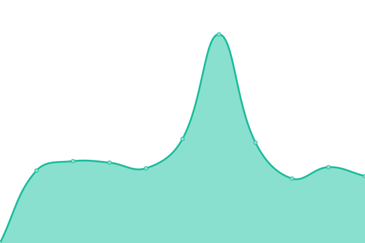

# [📈 Live Status](https://techsupp.github.io): <!--live status--> **🟧 Partial outage**

This repository contains the open-source uptime monitor and status page for [Upptime](https://upptime.js.org), powered by [Upptime](https://github.com/upptime/upptime).

With [Upptime](https://upptime.js.org), you can get your own unlimited and free uptime monitor and status page, powered entirely by a GitHub repository. We use [Issues](https://github.com/upptime/upptime/issues) as incident reports, [Actions](https://github.com/techsupp/uptime/actions) as uptime monitors, and [Pages](https://techsupp.github.io) for the status page.

<!--start: status pages-->
<!-- This summary is generated by Upptime (https://github.com/upptime/upptime) -->
<!-- Do not edit this manually, your changes will be overwritten -->
<!-- prettier-ignore -->
| URL | Status | History | Response Time | Uptime |
| --- | ------ | ------- | ------------- | ------ |
|  [zdrofit.pl](https://www.zdrofit.pl) | 🟩 Up | [zdrofit-pl.yml](https://github.com/techsupp/uptime/commits/HEAD/history/zdrofit-pl.yml) | 

 1195ms
     
 | 

<a href="https://techsupp.github.io/uptime/history/zdrofit-pl">99.82%</a>
    

|  [Karta MultiSport](https://kartamultisport.pl) | 🟩 Up | [karta-multi-sport.yml](https://github.com/techsupp/uptime/commits/HEAD/history/karta-multi-sport.yml) | 

 1799ms
     
 | 

<a href="https://techsupp.github.io/uptime/history/karta-multi-sport">100.00%</a>
    

|  [BenefitSystems](https://benefitsystems.pl) | 🟩 Up | [benefit-systems.yml](https://github.com/techsupp/uptime/commits/HEAD/history/benefit-systems.yml) | 

 3004ms
     
 | 

<a href="https://techsupp.github.io/uptime/history/benefit-systems">100.00%</a>
    

|  [www.BenefitSystems.pl](https://www.benefitsystems.pl) | 🟩 Up | [www-benefit-systems-pl.yml](https://github.com/techsupp/uptime/commits/HEAD/history/www-benefit-systems-pl.yml) | 

 1704ms
     
 | 

<a href="https://techsupp.github.io/uptime/history/www-benefit-systems-pl">100.00%</a>
    

|  [corp.BenefitSystems.pl](https://corp.benefitsystems.pl) | 🟩 Up | [corp-benefit-systems-pl.yml](https://github.com/techsupp/uptime/commits/HEAD/history/corp-benefit-systems-pl.yml) | 

 648ms
     
 | 

<a href="https://techsupp.github.io/uptime/history/corp-benefit-systems-pl">100.00%</a>
    

|  [DJtms.pl](https://djtms.pl) | 🟥 Down | [d-jtms-pl.yml](https://github.com/techsupp/uptime/commits/HEAD/history/d-jtms-pl.yml) | 

 245ms
     
 | 

<a href="https://techsupp.github.io/uptime/history/d-jtms-pl">100.00%</a>
    

|  [EMultiSport](https://emultisport.pl) | 🟩 Up | [e-multi-sport.yml](https://github.com/techsupp/uptime/commits/HEAD/history/e-multi-sport.yml) | 

 550ms
     
 | 

<a href="https://techsupp.github.io/uptime/history/e-multi-sport">100.00%</a>
    

|  [Yes2Move.com](https://yes2move.com) | 🟩 Up | [yes2-move-com.yml](https://github.com/techsupp/uptime/commits/HEAD/history/yes2-move-com.yml) | 

 1297ms
     
 | 

<a href="https://techsupp.github.io/uptime/history/yes2-move-com">100.00%</a>
    

|  [MyBenefit.pl](https://mybenefit.pl) | 🟩 Up | [my-benefit-pl.yml](https://github.com/techsupp/uptime/commits/HEAD/history/my-benefit-pl.yml) | 

 4706ms
     
 | 

<a href="https://techsupp.github.io/uptime/history/my-benefit-pl">99.72%</a>
    

|  [Sklep Y2M](https://sklep.yes2move.com) | 🟥 Down | [sklep-y2-m.yml](https://github.com/techsupp/uptime/commits/HEAD/history/sklep-y2-m.yml) | 

 0ms
     
 | 

<a href="https://techsupp.github.io/uptime/history/sklep-y2-m">0.00%</a>
    

|  [Onet.pl](https://Onet.pl) | 🟩 Up | [onet-pl.yml](https://github.com/techsupp/uptime/commits/HEAD/history/onet-pl.yml) | 

 802ms
     
 | 

<a href="https://techsupp.github.io/uptime/history/onet-pl">99.43%</a>
    

|  [wp.pl](https://wp.pl) | 🟩 Up | [wp-pl.yml](https://github.com/techsupp/uptime/commits/HEAD/history/wp-pl.yml) | 

 2221ms
     
 | 

<a href="https://techsupp.github.io/uptime/history/wp-pl">100.00%</a>
    

<!--end: status pages-->

[**Visit our status website →**](https://techsupp.github.io)

## 📄 License

- Powered by: [Upptime](https://github.com/upptime/upptime)
- Code: [MIT](./LICENSE) © [Upptime](https://upptime.js.org)
- Data in the `./history` directory: [Open Database License](https://opendatacommons.org/licenses/odbl/1-0/)
